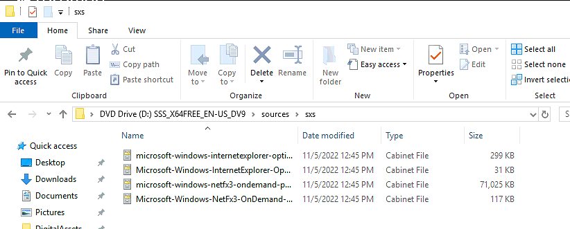

## Installing .NET 3.5 when install media is not available.

1. Download the Evaluation ISO of the server version in question from the Microsoft Evaluation Downloads.
2. Mount the ISO
3. In Server Manager Add the Feature for .NET 3.5 and specify the location by capturing the path to the mounted ISO, `\Sources\sxs` folder.

